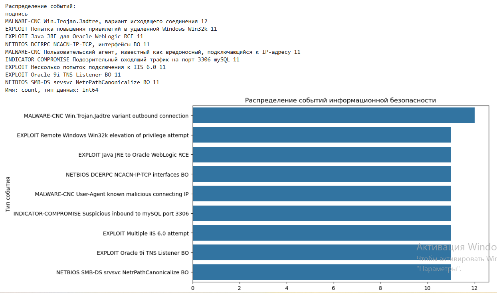

```
import json
import pandas as pd
import matplotlib.pyplot as plt
import seaborn as sns

# Данные предоставлены в тексте вопроса
with open('events.json', 'r') as file:
    data = json.load(file)

# Создаем датафрейм
df = pd.DataFrame(data['events'])

# Изучаем распределение событий
unique_signatures = df['signature'].value_counts()
print("Распределение событий:")
print(unique_signatures)

# График распределения событий
plt.figure(figsize=(10, 6))
sns.countplot(y='signature', data=df, order=df['signature'].value_counts().index)
plt.title('Распределение событий информационной безопасности')
plt.xlabel('Количество событий')
plt.ylabel('Тип события')
plt.show()

```
Результат:

